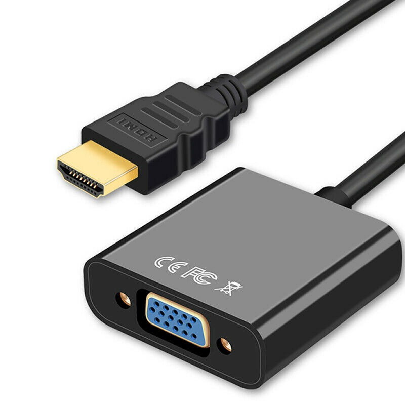
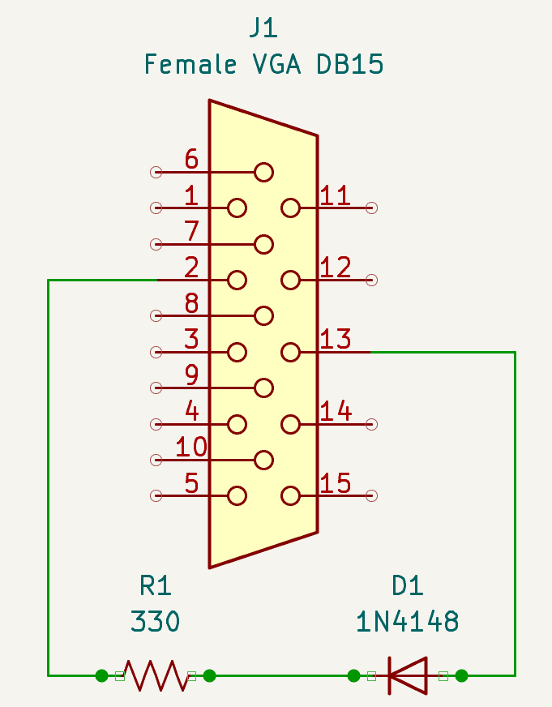

# Direct Video
Since autumn of 2019 there is a method for outputting analog video called *Direct Video* that doesn't require you to install the IO Board in your MiSTer. This new method offers **same** minimal latency to the VGA port from the IO Board and even better color depth in some cores. To enjoy it, you just need to activate the feature in your mister.ini file and attach a DAC to your HDMI port.

*You may use an HDMI-to-VGA converter similar to this one.*

*NOTE*: as of 2021/06/27 it seems very hard to find devices which are compatible with VGA to SCART adapters. Devices which work with VGA are still easy to find. More info here: https://github.com/MiSTer-devel/Main_MiSTer/issues/410

## Compatibility

*Direct Video* is compatible with most current cores and will be supported in all future cores coming to MiSTer.

RGBs, RGsB and YPbPr are supported, although YPbPr has less display compatibility in *Direct Video* mode compared to YPbPr from the IO Board.

Note that output resolution and format can vary from core to core. See [the analog video configuration table](crt.md/#configuration-table) for more information.

## How to Use

First you need a simple DAC with VGA output. Those based on the chip AG6200/AG6201 (like the one in the picture) are proven to work fine and are fairly inexpensive and easy to find. Also many of them output analog audio too. The only thing we recommend is to not hotplug them or pull them out from your MiSTer while it is still **ON**, since you might damage your HDMI port in the process.

Then you need to add the following line to your [mister.ini](ini.md) file:

`direct_video=1`

This activates the *Direct Video* feature when the system starts. Once it's enabled, it allows your HDMI port to output the raw and unprocessed digital audio/video signal from the loaded core, which is consumed by your DAC. MiSTer will not work with your HD TV or monitor while this mode is enabled, since they require a standard HDMI signal to work, and the zero-lag *Direct Video* signal **IS NOT** standard HDMI.

The resulting analog video signal from your DAC should be compatible with standard CRTs if the core loaded supports standard CRT refresh frequencies (see [analog video compatibility](Analog-video-output-compatibility) for more details). But there is still a bit of additional configuration you need to do depending on which kind of analog video signal you want to use.

## Setup for RGB signals

For analog RGB output, you'll want to enable composite sync on the HSync signal in your mister.ini (`composite_sync=1`). After that, you are good to plug in an RGB-compatible VGA-SCART cable to your TV.

For optimal results, [Retro Access](https://retro-access.com/products/mister-io-scart?_pos=1&_sid=97cb11000&_ss=r){target=_blank} sells SCART and BNC cables specifically for use with MiSTer.

**DISCLAIMER:** Please be aware that many VGA DACs may output a sync signal at **3 volts _or more_** on pin 13 (HSYNC/CSYNC) even when being used in *Direct Video* mode! You will need a 470 ohm resistor on the corresponding SCART sync pin to attenuate this signal to levels that are safe for all video equipment. A variety of professional video equipment can have wide tolerances for higher voltage sync signals but other devices, especially external scalers like the OSSC or XRGB Mini Framemeister, can be worn out and reduced to a non-working state by repeated use with higher-voltage sync signals. Unless you are 100% certain your equipment can tolerate higher voltage signals, it is _strongly_ recommended that you either purchase a cable that has a 470 ohm resistor inline or add one yourself. Retro Access MiSTer SCART cables, for example, come with a resistor inline by default.

## Setup for YPbPr signals

YPbPr - also known as Component Video - is available in *Direct Video* mode but has limited compatibility. This is due to limitations of HDMI-to-VGA DACs, which were not meant to produce signals in the YPbPr color space in the first place, resulting in signals that are slightly out-of-spec. It is possible that your display will accept the *Direct Video* YPbPr signal with no issue, but it may also appear bright pink [due to the way many displays process such signals](https://github.com/MiSTer-devel/Main_MiSTer/issues/210#issuecomment-622672178){target=_blank}. For higher YPbPr compatibility you may prefer RGB mode with an external RGB-to-YPbPr transcoder instead, or YPbPr via the IO Board.

To use YPbPr in *Direct Video* mode, you'll need to enable `composite_sync` and `ypbpr` in your [mister.ini](Configuration-Files) file. 

You'll also need to add a sync-on-green circuit on your VGA connection. Sync-on-green circuits can be very simple; you just need a diode (1N4148) and a 1k resistor.

*Connection: from HSync -> anode of diode, cathode of diode -> resistor, resistor to Green signal.*

## Doubling frequency

This is a handy way to use those modern monitors that have VGA input but are typically not compatible with 15KHz signals, and require 31KHz analog video. In case you need it, you just have to set `forced_scandoubler=1` in your mister.ini to turn a 15KHz signal into a 31Khz one (See which cores output 15KHz video [here](Analog-video-output-compatibility)).

## Color Depth

*Direct Video* produces a 24bit color signal, which is superior to the 18bit signal coming from the IO Board. However, few cores use 24bit color, so the improved color depth may not make much of an impact depending on the cores you run.

Also, most cheap DACs, like the ones based on the chip AG6200, don't produce Full Range RGB. They instead produce Limited Range RGB (16-235) or much more commonly a nonspec Limited Range variant (16-255). In order to compensate for this, you may want to configure the `hdmi_limited` option in your mister.ini to adjust the signal being sent to your DAC.

- Full Range (0-255): `hdmi_limited=0`.
- Limited Range (16-235): `hdmi_limited=1`.
- Limited Range common DAC variant (16-255): `hdmi_limited=2`.
