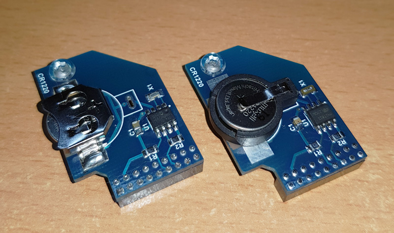
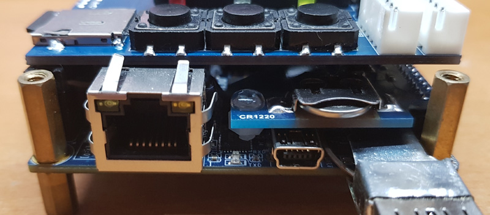

Some cores (ao486, Minimig) use clock, so MiSTer provides the real time for such cores. MiSTer can take the time from internet if active connection is present. 

This board is pretty simple and provide real time offline. It supports 2 types of battery holders and several types of RTC ICs. It's plugged into LTC connector.

## Assembling notes

* If through hole battery holder is used, you need to cut all its plastic pins and make sure the holder is fully seated on board without gaps. Otherwise it may touch the I/O board and make short circuit.
* For through hole holder, make sure you cut the pins as short as possible so it won't protrude under the board which can make short circuit.
* The board has the hole on opposite side of connector. Use a plastic(or other non-conductive) screw to make a leg and prevent the board bend and touch the main board.
* SMD holder (left picture) is preferable as it's more slim.

## Usage notes

To get real time saved, simply connect MiSTer to internet and let it run for around 15 minutes. 

Or from the console: 

By default the time zone is UTC(GMT). If you want to get the time of your zone, you need to do following:

* connect to MiSTer by FTP/SFTP
* navigate to `/usr/share/zoneinfo/posix` folder and find there the name of your place or time zone.
* copy that file to your computer under name timezone
* copy it back to MiSTer to folder `/media/fat/linux` with name timezone

From the console you can also force the hardware clock to update and read the time from it:

* **store datetime to RTC** : `hwclock -wu`
* **read RTC** : `hwclock -u`

## RTC Add-on board DIY Assembly

This page is for reference only. It may not be up to date. It may not include the BOM for latest PCB version. You need to check the schematic and required components yourself!

The following section will walk you through the steps of creating your own Mister RTC Board. It describes where to order all necessary parts like PCB and components. It will also give you an overview on the equipment you need and show you how to assemble the board.

### 1. Order PCB

#### Approved PCB Manufactors

  * [PCBway](https://www.pcbway.com/setinvite.aspx?inviteid=43024){target=_blank} - [Quick order RTC v1.2](https://www.pcbway.com/project/shareproject/RTC_for_MiSTer_v1_2.html){target=_blank} - [Quick order RTC v1.3 (with temp sensor)](https://www.pcbway.com/project/shareproject/W43024ASU40_rtc_1_3.html){target=_blank}
  * [EasyEDA](https://easyeda.com/){target=_blank}
  * [JLCPCB](https://jlcpcb.com/){target=_blank}
  * [OSH Park](https://oshpark.com/){target=_blank}

#### PCB Layout (Gerber Files)
Check the MiSTer hardware repository for the most recent PCB files: [MiSTer_Hardware](https://github.com/MiSTer-devel/Hardware_MiSTer){target=_blank}

### 2. Order Components

This is a general overview of the components, including reference parts that were successfully used to assemble a MiSTer RTC Board **version 1.2**.

#### General Components:
The components in this table are the general components. You will have to choose additionally a RTC chip and crystal combination from the next table

| Name | Component | Package | Value | Reference Parts |
|---|---|:---:|:---:|---|
| C1 | Capacitor (Ceramic) | 0805 | 10uF | [KEMET   C0805C106K8PACTU](https://www.digikey.com/products/en?keywords=399-4925-1-ND){target=_blank} |
| R1, R2 | Resistor 1% 1/8W | 0805 | 4.7K | [Yageo   RC0805FR-074K7L](https://www.digikey.com/products/en?keywords=311-4.70KCRCT-ND){target=_blank} |
| B1 | Coin Cell Holder for CR1220 | 12mm | - | [MPD   BK-885](https://www.digikey.com/products/en?keywords=BK-885-ND){target=_blank} |
| P1 | GPIO Connector | 2mm | 18 Pin | [Amphenol   63453-118LF](https://www.digikey.com/products/en?keywords=%09609-2663-ND){target=_blank} |

#### RTC / Crystal Table
The RTC Chip (U1) / Crystal (X1) combination in this table are approved by users that successfully build a RTC Board version 1.2

| Name | Component | Package | Value | Reference Parts |
|---|---|:---:|:---:|---|
| U1 | I2C RTC Chip:   M41T81 | 8-SOIC | - | [ST   M41T81M6F](https://www.digikey.com/products/en?keywords=497-4709-1-ND){target=_blank} |
| X1 | Crystal:   32.768kHz ±20ppm, 12.5pF, 50 kOhms  | Cylindrical Can | - | [Citizen   CMR200T32768DZFT](https://www.digikey.com/products/en?keywords=%09300-8340-6-ND){target=_blank} |

[Example of BOM on Octopart](https://octopart.com/bom-tool/95qomeBj){target=_blank}