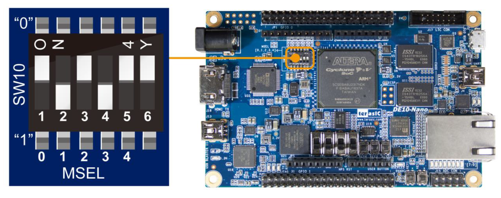
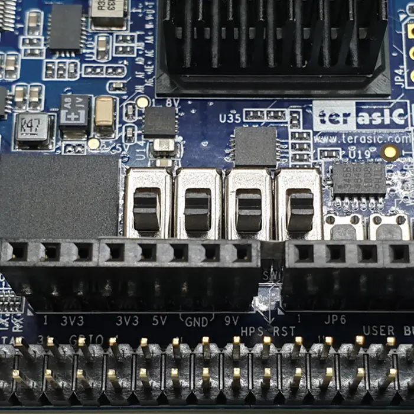
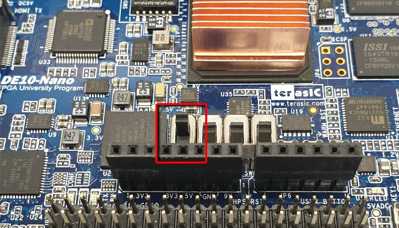

---
hide:
  - toc
---

## The MiSTer FPGA's correct DIP switch configuration on the DE10-Nano

If your keyboard doesn't work or something else low-level hardware related doesn't work, it's possible that one or more of the DIP switches on your DE10-Nano are misconfigured. Make sure the DIPS are configured like the following pictures:  
  

Side Note: If you have a Digital IO board then your first of the large dips in the 2nd picture above needs to be turned On (up) and the rest should be turned off (down) in order to use the 2nd SDRAM module, if you have one. Here's a demonstration with a picture again:  
  
*Credit for 2nd and 3rd pictures goes to Nat from [MiSTerFPGA.co.uk](https://misterfpga.co.uk){target=_blank}*

## My gamepad doesn't work

If your gamepad doesn't work in the menu, you need to make sure you have [defined your inputs for that gamepad](../setup/controller.md){target=_blank}. If your gamepad doesn't work in the core, but it does work in the menu, then you need to define the gamepad in that core in the secondary OSD menu. If neither of these work, make sure you your DIP switches are correct as shown above.

## My Keyboard doesn't work right

If you have a fancy gamer keyboard with lots of macros and RGB lights, it's possible that the stock power supply is not providing enough power. You may want to consider purchasing an upgraded power supply with more amps as a way to fix this, like the [Mean Well GST18A05-P1J](https://www.amazon.com/MEAN-WELL-GST18A05-P1J-Desktop-Adaptor/dp/B01LZ0LJXQ){target=_blank} or take a look at this [DigiKey search result](https://www.digikey.com/short/33rwd9pm) to get a better idea of what is required. Generally speaking you need a 5v power supply with more than the stock 2amps, with a 2.1mm x 5.5mm x 11.0mm barrel plug that has positive center polarization. Mean Well and Triad are often recommended brands, but they are not the only option if you cannot find them at your desired retailer.

## Fixing missing certs

If you are unable to use wget, this might be because you are missing security certificate files. The default system comes with no security certificate files so you need to add --no-check-certificate on wget to download anything HTTPS:

1. Open the linux terminal/command prompt with F9, use `root` as your username and `1` as your password.
2. Type `cd /etc/ssl/certs` and press enter.
3. Type `wget --no-check-certificate https://curl.haxx.se/ca/cacert.pem` and press enter

Assuming it downloaded correctly, you can _now_ use wget as nature intended.
