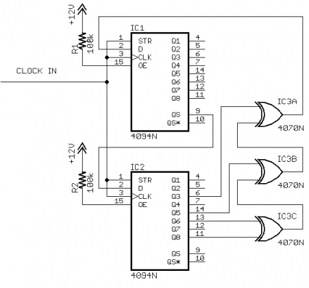
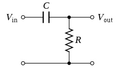
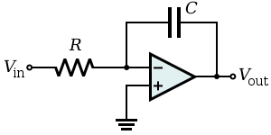

*Article by MiSTer core developer Jegor van Opdorp (SupraDeus/jopdorp)*

Many old computers have analog parts, for example audio boards that have partly analog synthesis and old desktop computers with tape input.

Currently there is no convenient way to directly simulate electronic circuits, for example based in their spice netlists, in real time on the MiSTer. So to implement these type of circuits in fpga, you will have to come up with some kind of simulation of the behavior of the electronic circuit.

The [Arcade-Battlezone](https://github.com/jopdorp/Arcade-BattleZone_MiSTer){target=_blank} core is an example of a core with analog sound synthesis.

## A way to approach the problem:

1. Find youtube video's of people playing the actual game, to get some idea of the sounds it has.
2. Play the game in an emulator, paying extra attention to sounds that do not sound the same in the emulator as in the video of the actual machine.
3. Identify the digital and analog parts of the schematic.

    * One thing to keep in mind is that the digital parts run at the system clock speed, or sometimes a separate clock source that is closer to the audible frequency spectrum, in Arcade Battlezone there is a 12khz input to a digital noise circuit, of which the output goes into and analog integrator circuit. This creates an axplosion sound. The implementation of this sound is listed at "inverting amplifier" below. The analog parts will be outputting at audio sample rate, i.e. 48khz

4. Implement all the digital parts, common digital components in sound systems are:  

    * linear feedback shift register:  
      
    An implementation of a similar circuit in arcade battlezone can be found [here](https://github.com/jopdorp/Arcade-BattleZone_MiSTer/blob/sound/rtl/noise_shifters.sv){target=_blank}:

    * flipflops, like the jk flipflop, implemented [here](https://github.com/jopdorp/Arcade-BattleZone_MiSTer/blob/sound/rtl/jk74109.sv){target=_blank}:

5. Identify analog circuits with isolated behavior, i.e. 1 input, 1 output. These can be individually implemented and tested.
6. Identify common, easily recognisable and implementable parts, such as:

   * [low pass filters](https://www.electronics-tutorials.ws/filter/filter_2.html){target=_blank}  
       
     This can be implemented using an iir low pass filter, you can find the parameters using [this spreadsheet](https://docs.google.com/spreadsheets/d/1Z2DNhAQyqkDpNVJuzYPk3ZeW4rChxN7fTKsLGvb2r7g/edit#gid=0){target=_blank}
      
      Some implementations of iir filters:

      * [Blockade Low Pass Filter](https://github.com/MiSTer-devel/Arcade-Blockade_MiSTer/blob/main/rtl/audio/blockade_lpf.v){target=_blank}
      * [Blockade Infinite Impulse Response (IIR) 1st Order Filter](https://github.com/MiSTer-devel/Arcade-Blockade_MiSTer/blob/main/rtl/audio/iir_1st_order.v){target=_blank}
      
      A simpler type:

      * [Blockade Infinite Impulse Response (IIR) Filter](https://github.com/jopdorp/Arcade-BattleZone_MiSTer/blob/sound/rtl/iir.sv){target=_blank}
   
   * [high pass filters](https://www.electronics-tutorials.ws/filter/filter_3.html){target=_blank}

      

   * inverting amplifiers

      

     This is essentially a sign inversion of the sample, followed by a (fixed sign) multiplication.

   * non inverting amplifiers

      

     This is just a (fixed sign) multiplication of the sample

   * differential amplifiers

      

   * inverting integrators

      

     or

      

     This is essentially a sign inversion of the sample, followed by a multiplication, with the result being stored in a reg.

     The multiplication is run repeatedly, each audio clock cycle, Resulting in a "release/decay" type amplifier envelope.
     
     An example of an implementation of this can be found [here](https://github.com/jopdorp/Arcade-BattleZone_MiSTer/blob/6606cbce7760c60fc06e613292f731f76ffb18ba/rtl/noise_sound.sv#L52){target=_blank}

   * other common [opamp circuits](https://en.wikipedia.org/wiki/Operational_amplifier_applications){target=_blank}
   * [additive mixers](https://en.wikipedia.org/wiki/Electronic_mixer){target=_blank}

     

     An additive mixer just adds up/averages two signals. If the resistance is higher for one signal than the other, this will result in a volume difference between them.

7. All the parts that are going to need more attention, make note of what these parts are an try to guess what they are for. [Differentiators](https://en.wikipedia.org/wiki/Operational_amplifier_applications#Inverting_differentiator){target=_blank} and [integrators](https://en.wikipedia.org/wiki/Operational_amplifier_applications#Inverting_integrator){target=_blank} combined with [555 timers](https://www.electronics-tutorials.ws/waveforms/555_oscillator.html){target=_blank}  and noise inputs can be tricky.
8. Implement the mixers
9. Implement the filters
10. Implement the difficult parts of the circuit:
   1. Implement the circuit in a simlator.
   2. Figure out what input goes into the circuit when the game gets played.
   3. Run the simulation with the correct input and save the output as a wav file
   4. Analyse the output by looking at it in a wave editor like audacity and listening to it.
   5. Is the input always the same? (not noise as input) Does the circuit always response in the same way? (not generating noise)
      1. Sample the output of the simulation
      2. Convert the sample into an array literal and trigger it as needed, usually the sample will just be triggered by a pulse in this case.
   6. If the analog circuit has noise as input or has variable inputs such as a number controlled frequency or speed you will need to:
      1. make a mathematical model of the analog circuit.
      2. implement the model in an easy to use programming language such as python
      3. compare the output of the mathematical model with the output of the circuit simulation using the same inputs. They have to be close, but not identical, but they should be identical to the hearing.
      4. rework your mathematical model to not have to use any dividers in real time, this is done in two steps 
         1. by algebra
         2. by precalculating any left-over divisions into division lookup-tables
      5. you can also create other kind of lookup tables, for example a sine wave.
      6. implement the mathematical model in HDL
    7. verify the outputs of the HDL with a tesbench
    8. hook up the chip to the rest of our core!

## Handy links:
### Developer journeys of analog circuit implementations
[MiSTer - Head On](headonsoundpcb.md)

### Informational resources
* For finding the right values of a filter: [https://www.micromodeler.com/dsp/](https://www.micromodeler.com/dsp/){target=_blank}
* Common operational amplifier uses, such as differentiators and integrators: [https://en.wikipedia.org/wiki/Operational_amplifier_applications](https://en.wikipedia.org/wiki/Operational_amplifier_applications){target=_blank}
* Explanation of how 555 timers work: [https://www.electronics-tutorials.ws/waveforms/555_oscillator.html](https://www.electronics-tutorials.ws/waveforms/555_oscillator.html){target=_blank}
* Spice programming [https://www.allaboutcircuits.com/textbook/reference/chpt-7/fundamentals-spice-programming/](https://www.allaboutcircuits.com/textbook/reference/chpt-7/fundamentals-spice-programming/){target=_blank}

### Code examples
* [example of a noise-based sound python implementation in a notebook](https://github.com/jopdorp/Arcade-BattleZone_MiSTer/blob/sound/spice/Red%20baron%20crash%20circuit%20sim.ipynb){target=_blank}
* [example of a piece of python code that generates a lookup table](https://github.com/jopdorp/Arcade-BattleZone_MiSTer/blob/sound/rtl/generate_control_coltages_to_frequency.py){target=_blank}
* [example of a common digital noise generator](https://github.com/jopdorp/Arcade-BattleZone_MiSTer/blob/sound/rtl/noise_source_shell_explo.sv){target=_blank}
* [example of a sine-based sound that takes noise as input](https://github.com/jopdorp/Arcade-BattleZone_MiSTer/blob/sound/rtl/bang_sound.sv){target=_blank}
* [example of a script that can take the output of a spice simulation and generate a wav file from it](https://github.com/jopdorp/Arcade-BattleZone_MiSTer/blob/sound/spice/spicetowav.py){target=_blank}
* [example of a spice netlist for a noise based sound](https://github.com/jopdorp/Arcade-BattleZone_MiSTer/blob/sound/spice/bang.cir){target=_blank}

### Tooling
* [https://www.falstad.com/circuit/](https://www.falstad.com/circuit/){target=_blank}
* [http://ngspice.sourceforge.net/](http://ngspice.sourceforge.net/){target=_blank}
* [https://www.audacityteam.org/](https://www.audacityteam.org/){target=_blank}
