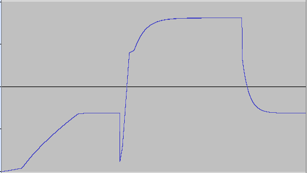
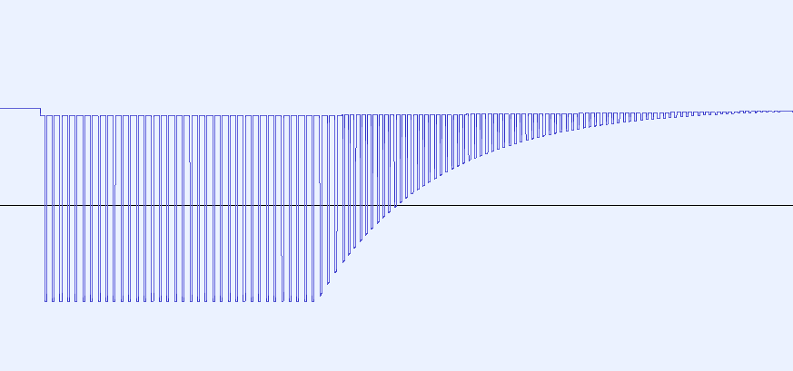

---
hide:
  - toc
---

*Article by MiSTer core developer Jegor van Opdorp (SupraDeus/jopdorp)*

This article contains a description of how we implemented the sound PCB of the game Head On from SEGA/Gremlin.

## First steps
We analyzed the schematics of the Head On sound PCB board. Identifying circuits for individual sounds, and repeated parts of the circuit.


We talked about what we thought is what, and decided to start with the car sound.

## Finding real footage
Searching the web for video's with the sounds, we found a couple, but the quality was bad:

https://discord.com/channels/@me/950484205664612402/951108401801338890

https://discord.com/channels/@me/950484205664612402/951139287745851425

JimmyStones contacted the maker of the sound board, to see if he had some tips. He seemed willing to help, but not familiar enough with the fpga domain to join the project. The JimmyStones found someone who own a cabinet and was able to obtain some good sound recordings.

This gave us a way to validate our results.

## Simulating and analyzing

### Car
We started by implementing the car sound in the falstad simulator. It took some tweaking, mostly getting things like the diode type and transistor beta values right. We managed to get a result that sounded pretty much like the real deal.

This is the final circuit:
[car_circuit.txt](https://github.com/MiSTer-devel/Main_MiSTer/files/8336074/car_circuit.txt) it can be loaded into the [falstad simulator](https://www.falstad.com/circuit/) Frow there it is possible to record a wav file, which we used to analyze the sound.

It turns out that the car sound consists of a repeating waveform that looks like this:


The frequency of this waveform is modulated. It starts inaudibly low. Then when the game starts, it follows an upward curve until a limit. When the "high speed" button is pressed it momentarily drops in frequency and follows a quick upward curve, and follows a downward curve when it is released, like so:



Based on this information we were able to come up wih an implementation strategy:

* Turn the waveform into an array
* Turn the frequency response curve into trhee lookup tables:
    * One for the start of the game
    * One for when the "high speed" button is pressed
    * One for when the "high speed button is not pressed
* Follow the frequnce curve as needed, according to the current state.

### Bonus
The bonus sound seemed simple at first, but turned out to be more complicated than we thought. When the bonus input goes high shortly, and then low. The sound is quite simple, like so:



We came up with a algorithm to describe this sound, and implemented it in a SystemVerilog module.

#### The algorithm:

Bonus is a pulse generator, that goes to 100% amplitude immediately when the bonus pin goes high. The pulse is always running, just multiplied by an amplitude.

When the bonus pin goes low, the sound decreases in volume following a an exponential curve. When the bonus pin is low, the pulse period is 3/4 of the length, resulting in a [perfect fourth](https://en.wikipedia.org/wiki/Perfect_fourth)

The amplitude halves every 28 ms so it's something like:

`Amplitude = MaxAmplitude-((0.976^time_in_miliseconds)*MaxAmplitude)`

MaxAmplitude should be set to the highest number that fits, in for example 32 bits, to keep precision. Normally I use fixed point math with 32 of precision for multiplications like this. Later we will convert to 16 bits precision, for the output.

The pulse period when the bonus pin is high has length 0.002746s, and it's high 75% of the time so equivalent to a loop of:

`{1,1,1,0}`

The final result looks like it goes through a very slight low pass filter. This basically results in a loop of:

`{97{2}, 1, 33{0}, 1} `

At 48khz this results in a wavelengths of 0.00275s

We implemented this in SystemVerilog like so:

```sv
module bonus(
    input clk,
    input clk_48KHz_en,
    input bonus_en,
    output reg[15:0] audio_out = 0
);

    localparam MAX_AMPLITUDE = 1 << 18 << 14;
    reg[1:0] WAVEFORM_SLOW[131:0];
    reg[1:0] WAVEFORM_FAST[98:0];
    assign WAVEFORM_SLOW[97] = 1;
    assign WAVEFORM_SLOW[131] = 1;
    assign WAVEFORM_FAST[73] = 1;
    assign WAVEFORM_FAST[98] = 1;

    genvar i;
    generate
        for (i = 0; i <= 96; i = i + 1) begin
            assign WAVEFORM_SLOW[i] = 2;
        end
        for (i = 98; i <= 130; i = i + 1) begin
            assign WAVEFORM_SLOW[i] = 0;
        end
    endgenerate

    genvar j;
    generate
        for (j = 0; j <= 72; j = j + 1) begin
            assign WAVEFORM_FAST[j] = 2;
        end
        for (j = 74; j <= 97; j = j + 1) begin
            assign WAVEFORM_FAST[j] = 0;
        end
    endgenerate
    

    localparam AMPLITUDE_RATIO_PER_TIMESTEP_18 = 262008; // z^(28ms*48khz) = 0.5, so z = 0.99948, 0.99948 * 2^18 = 262008

    reg[9:0] current_sample = 0;
    reg[68:0] amplitude = 0;

    reg last_bonus_en = 0;

    localparam SLOW_TO_FAST_RATIO_16 = 87381; // 4/3 * 2^16 = 87381.3333333
    reg[15:0] map_slow_to_fast = ((current_sample * SLOW_TO_FAST_RATIO_16) >> 16);

    always_ff @(posedge clk) begin
        if(clk_48KHz_en)begin
            last_bonus_en <= bonus_en;

            if(bonus_en)begin
                amplitude <= MAX_AMPLITUDE;

                if(current_sample == 131)begin
                    current_sample <= 0;
                end else begin
                    current_sample <= current_sample + 1;
                end
                audio_out <= (amplitude * WAVEFORM_SLOW[current_sample]) >> 18;
            end else begin 
                if(last_bonus_en)begin
                    current_sample <= map_slow_to_fast;
                    audio_out <= (amplitude * WAVEFORM_SLOW[current_sample]) >> 18;
                end else begin
                    if(current_sample >= 98)begin
                        current_sample <= 0;
                    end else begin
                        current_sample <= current_sample + 1;
                    end
                    audio_out <= (amplitude * WAVEFORM_FAST[current_sample]) >> 18;
                end
                amplitude <= (AMPLITUDE_RATIO_PER_TIMESTEP_18 * amplitude) >> 18;
            end

        end 
    end

endmodule
```

But it turned out that this was not the whole story. At the end of the game, the bonus pin goes high for a longer time, which triggers a different effect, where the frequency of the tone gets modulated in a more complex way. We had to go back to simulation, where it turned out that the NOT gated at the bottom had the wrong voltage threshold assigned to them.


While this did not change the short bonus sound, which the machine makes when a jewel is picked up, it does change the sound when the bonus pin goes high for a longer period. It turned out that the Falstad simulator was not fast enough to simulate this circuit though.

We then turned to LTspice see if that was quick enough.
