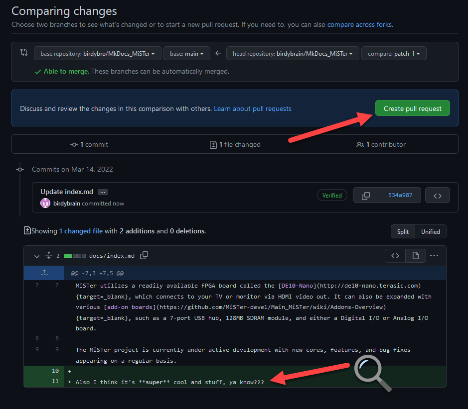
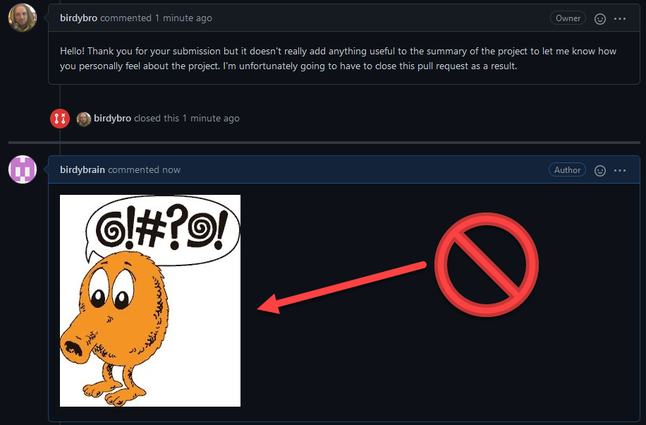

---
hide:
  - toc
---

Here's a quick guide to show you how to edit this documentation site. It's very similar to editing a wiki page, but requires a couple extra steps. All edits are approved by the administrators of the MkDocs_MiSTer repository on GitHub for quality control purposes.

## How to edit/contribute to pages on this documentation site

First, you will need a github account:

[Signup to GitHub](https://github.com/signup){target=_blank}

Next you go to the page you want to edit and click on the pen icon in the top right for that page:

Then you need to fork the repository for this documentation. A repository is just what coders call the place where they store all the code for their project. A fork is just a personal copy of that repository where you can make your own changes to it. So let's click "Fork this Repository":

Now make your changes using the text editor. The MkDocs_MiSTer site uses the [Markdown syntax](https://www.markdownguide.org/cheat-sheet/){target=_blank}, so make sure to follow those guidelines. The editor comes with a Preview Tab so you can see how your work may appear. Certain MkDocs specific tags or formatting (e.g. `{target=_blank}` which makes your browser open a link in a new tab):

Write in a short description of your changes and propose the changes that describes why you made the changes:

The next step is to create a pull request. Pull requests are a way of asking the repository owner to accept the changes you've made into their repository. Double check your work to make sure it is what you wanted:

The form to create a pull request will appear. This is your last chance to double-check your work before creating the pull request to ask the owner to "merge" your changes into the main repository. Merging these changes will update the site momentarily, so make sure the changes you made are correct:

In this case, the user birdybrain submitted a very goofy change, and as such his pull request was denied (and closed). This upset birdybrain quite a bit and he was disrespectful in his reply. Be respectful and understanding and try to work with the owners of the repository. Don't be like birdybrain here:

Hopefully that helps you learn how to edit the documentation on this site. If you completed this and edited a page, congratulations! You now should know how to use GitHub, fork a repository, commit changes to the source code, and create a pull request.