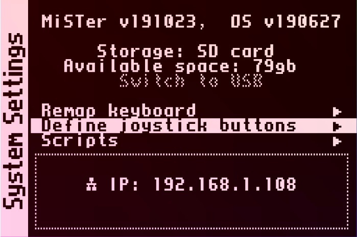
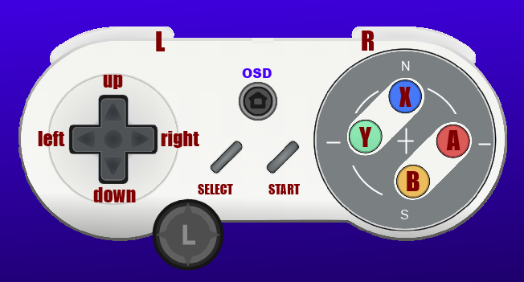

---
hide:
  - toc
---

Now we should define some gamepad inputs on our MiSTer. This is pretty easy to do. You should use a keyboard and your gamepad/controller for this step. For each different kind of controller you have, you should do this step, and the MiSTer will store a configuration based on that device's unique ID.

## Defining your Gamepad's buttons
Go to the second menu in the On Screen Display where you went to for to run the Downloader or WiFi scripts. There is another option here, "Define joystick buttons". Select this option to configure your buttons on your gamepad:

It will guide you through the process of detecting your general controller type by asking you to press a few d-pad buttons and maybe the analog sticks. 

Then it will ask you to assign some buttons:

* Four face buttons and two shoulder buttons
* Start and Select
* OSD button or 2-button combo (to use instead of F12 on the keyboard)
* A few extra buttons for advanced functions

Skip any buttons you don't want to assign (there may be a lot of them) with the spacebar. If you accidentally assign the wrong button, don't worry, just define it all over again from the start.

If you press enter to "Finish" too early, you might miss the Analog Joystick configuration step which is important if you have analog joysticks.

Here is a picture to give you an idea of what the buttons it is asking you to press may represent:

The L on the bottom left is referring to an analog joystick. Your controller may or may not have this. If it does, the step to define the analogy joystick's input is at the end, so your joystick will not work unless you go through the entire list of inputs to define.

Another important button is the OSD button. Many modern controllers have a "Home" button, it's probably best to assign this to the OSD/Menu. If you do not assign anything to home, the only way to access the menu will be to use the F12 key on a keyboard.

### Define Gamepad Inputs/Buttons Example Video

