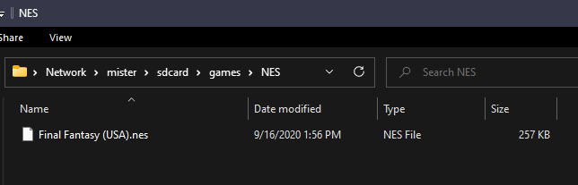

---
hide:
  - toc
---

To play games on the MiSTer you will need to transfer them to your MicroSD. There are other ways to load games, like over a NAS or using USB drive, but for now we're going to stick to the most basic easy method. If you'd like more information on these other methods you can head to the [Advanced Networking Page](../advanced/network.md) of this site, to find out more.

## Games folder description
The `/games/` folder is where ROMs are stored. `/games/NES` is where you would place NES ROMs, for instance. Each MiSTer core looks to a specific folder for these ROMs so it is best to put them in the right place.

## Transfer ROMs over the Network with Samba/SMB
The MiSTer comes setup with a Samba server already, it just needs to be activated. This means you can connect to it like any other shared folder on the network. It's pretty easy. 

First we need to enable the Samba service:

1. Enter the terminal/command line of the MiSTer by press `F9` on your keyboard and type `root` for the username, press enter, and type `1` for the password and press enter.
2. Rename `/media/fat/linux/_samba.sh` to `/media/fat/linux/samba.sh` in the terminal/console on the MiSTer by running the following command:
```
mv /media/fat/linux/_samba.sh /media/fat/linux/samba.sh
```
3. Reboot the MiSTer
4. If you are using Windows, all you need to do is type `\\MiSTer\sdcard\` in the address bar at the top of the File Explorer and press enter. You can do the same in Linux or on MacOS depending on how you access network shares on those systems the same way.


In this case I'm going to transfer some ROMs to the `/games/NES/` folder so I can use them with the NES core.



## Transfer ROMs to the MicroSD directly
You can also turn off the MiSTer, remove the MicroSD and plug it into your computer to transfer roms. It will have an exFAT formatted partition named "MiSTer" that most operating systems can work with.

After this is done you can proceed to the next step since we are going to [Play a Game](play.md).

## File Formats
CD images for any cores that use CD's must either be in CUE/BIN or CHD. CD Images can't be placed in zip folders/archives.

VHD (virtual hard drive) files are the same, they must not be zipped.

All other ROMs can be placed in zip folders/archives and accessed. The core will tell you which file extensions are accepted. If you have an issue with a ROM loading, the readme for that core that is available on GitHub or in the `/games/$CORE/` folder should tell you what kinds of files work with that core.
