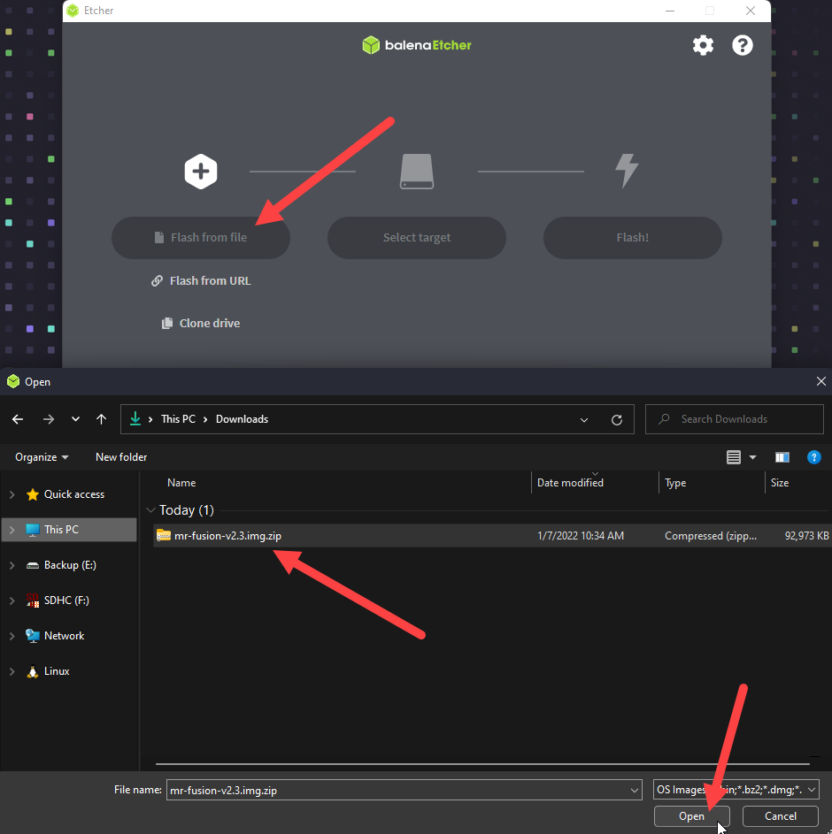
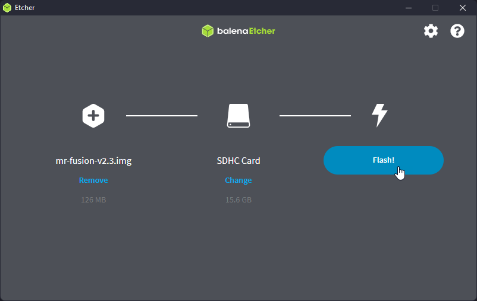
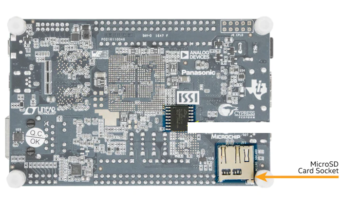

---
hide:
  - toc
---

First thing to do is to install the software onto your MicroSD card.

## Flash Mr. Fusion to your MicroSD
Mr. Fusion provides a compact image that you can download and flash onto an SD card of any size with a tool like  [balenaEtcher](https://www.balena.io/etcher/){target=_blank}, [Win32 Disk Imager](https://sourceforge.net/projects/win32diskimager/){target=_blank}, [Apple Pi Baker](https://www.tweaking4all.com/software/macosx-software/applepi-baker-v2/){target=_blank}, or even [dd](https://en.wikipedia.org/wiki/Dd_%28Unix%29){target=_blank}.

We're going to use balenaEtcher for this guide. We install balenaEtcher by [downloading the latest release for our computer](https://www.balena.io/etcher/){target=_blank} and installing it. 

Next we're going to [download the latest release of Mr. Fusion](https://github.com/MiSTer-devel/mr-fusion/releases){target=_blank}:

{target=_blank}

Next, we will insert our MicroSD card into our computer and then open balenaEtcher. We will select "Flash from file" and navigate to the Mr Fusion file we downloaded a step earlier.

Then we need to select our MicroSD card as the target to flash.

And click "Flash!"

Wait for it to complete successfully.

If you see "Flash complete!" and "1 Successful target" then everything worked fine. If the flash fails, try and flash it again or flash a different MicroSD card in case the one you are using is malfunctioning.

We can now close balenaEtcher and remove our MicroSD card.

## Boot the DE10-Nano with Mr. Fusion
Next we just need to carefully insert our MicroSD card into the DE10-Nano (**NOT the MicroSD slot on the IO board on top!**).

Now turn on your DE10-Nano.

We will wait up to a few minutes for the Mr. Fusion installer to complete. Be patient, or else you may have to start all over again. 

When the MiSTer On Screen Display with fuzzy static behind it appears, that means you have successfully installed the MiSTer software/OS onto your MicroSD. 

Check out the next tutorials in the side bar!
